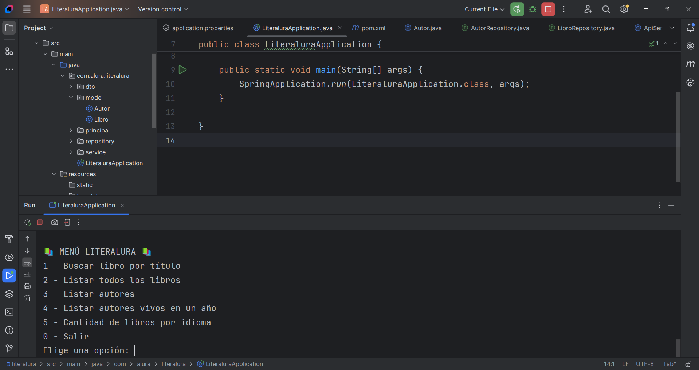

# 📚 Challenge: Literalura

## ✨ ¿Qué hace este programa?
Este programa permite **buscar, registrar y consultar libros** de la API pública **Gutendex**, almacenándolos en una base de datos local para gestionarlos desde la consola.

Con **Literalura** podemos:
- 🔎 Buscar libros por título.  
- 📖 Listar todos los libros almacenados.  
- ✍️ Listar autores.  
- 📅 Consultar autores que estaban vivos en un año específico.  
- 🌎 Ver cuántos libros hay por idioma.  

Todo esto se maneja desde un menú sencillo en consola.

---

## 💡 ¿Qué necesitas para usarlo?
- ☕ Tener **Java 21** instalado en tu computador.  
- 🐘 Tener **PostgreSQL** en ejecución (con una base de datos creada).  
- 🌐 Acceso a internet (para consultar la API de Gutendex).  

---

## 🛠️ ¿Cómo funciona?
Al iniciar, el programa muestra el menú de opciones en consola:

📚 MENÚ LITERALURA 📚
1 - Buscar libro por título
2 - Listar todos los libros
3 - Listar autores
4 - Listar autores vivos en un año
5 - Cantidad de libros por idioma
0 - Salir

- Si eliges la opción **1**, puedes escribir un título (o parte de él).  
- El programa se conecta a la API de **Gutendex**.  
- Si encuentra resultados, los guarda en la base de datos y los muestra en pantalla.  
- Las demás opciones consultan los datos ya guardados en la base de datos local.  

---

## 📦 ¿Cómo está hecho el programa?
El proyecto está desarrollado con **Java + Spring Boot** y usa una arquitectura organizada en:

- 📚 **Modelos (model)** → representan las entidades principales como `Libro` y `Autor`.  
- 📄 **DTOs (dto)** → mapean las respuestas de la API (ej. `LibroDto`, `AutorDto`).  
- 🗄️ **Repositorios (repository)** → gestionan la comunicación con la base de datos usando **Spring Data JPA**.  
- ⚙️ **Servicios (service)** → contienen la lógica de negocio (ej. buscar libros, listar autores, etc.).  
- 🖥️ **Aplicación principal (LiteraluraApplication)** → gestiona el menú interactivo en consola.  

---

## 📚 ¿Qué tecnologías se usaron?
- ☕ Java 21 🚀  
- 🌱 Spring Boot 3 🟢  
- 🐘 PostgreSQL (conexión a base de datos)  
- 📂 Hibernate / JPA (ORM para mapear objetos a tablas)  
- 🌐 Gutendex API (fuente de libros)  

---

## 📸 Demostración visual del menú de opciones:
### 🟢 Inicio del programa
El usuario ve el menú con todas las opciones ya explicadas anteriormente y puede interactuar con ellas.

 
